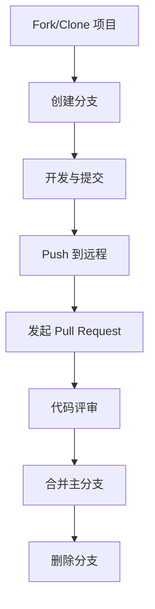

# github-flow

> 一个用于教学 Git 和 GitHub 规范化工作流的 Python 示例项目

---

## 项目简介

本项目旨在帮助初学者系统学习和实践 Git/GitHub 的标准工作流程，涵盖分支管理、提交规范、Pull Request、Issue、代码评审等核心环节。所有代码、配置和文档均严格规范，适合作为团队协作和个人学习的参考模板。

## 环境准备

- 推荐 Python 版本：3.8 及以上
- 推荐使用 [uv](https://github.com/astral-sh/uv) 管理 Python 版本
- 建议使用 [VS Code](https://code.visualstudio.com/) 或 [Cursor](https://www.cursor.so/) 作为开发环境

## 安装依赖

```bash
# 同步pyproject.toml要求，创建虚拟环境并安装依赖（本项目无强制依赖，仅示例）
uv sync
```

## 快速开始

```bash
git clone https://github.com/wangnov/github-flow.git
cd github-flow
python main.py --name "你的名字"
```

## Git/GitHub 教学流程



### 标准操作步骤
1. Fork 或 Clone 本项目到本地
2. 创建新分支（如 feature/your-feature）
3. 开发并规范提交（见下方提交规范）
4. Push 分支到远程仓库
5. 在 GitHub 上发起 Pull Request
6. 参与代码评审与讨论
7. 通过 Review 后合并到主分支
8. 删除已合并分支

## 代码规范
- 遵循 [PEP8](https://peps.python.org/pep-0008/) 编码规范
- 变量、函数、类命名需见名知意
- 每个函数/模块需有 docstring 注释
- 保持代码整洁、注释清晰

## 提交规范
- 推荐使用英文提交信息，格式如下：
  - `feat: 新增功能`
  - `fix: 修复问题`
  - `docs: 文档更新`
  - `refactor: 代码重构`
  - `chore: 其他维护`
- 提交信息应简明扼要，描述清楚变更内容

## 分支命名规范
- `feature/xxx` 新功能
- `fix/xxx`     修复
- `docs/xxx`    文档
- `chore/xxx`   其他

## 贡献指南
1. Fork 本仓库并创建新分支
2. 按规范开发与提交
3. 发起 Pull Request 并描述变更内容
4. 等待代码评审与合并

## 常见问题（FAQ）
- Q: 如何切换 Python 版本？
  A: 推荐使用 uv 工具自动切换。
- Q: 为什么要写详细的 .gitignore？
  A: 避免将无关文件纳入版本控制，保持仓库整洁。

## 参考资料
- [Pro Git 电子书](https://git-scm.com/book/zh/v2)
- [GitHub 官方文档](https://docs.github.com/zh)
- [uv](https://github.com/astral-sh/uv)

---

> 本项目仅用于教学与演示，欢迎贡献和反馈！
